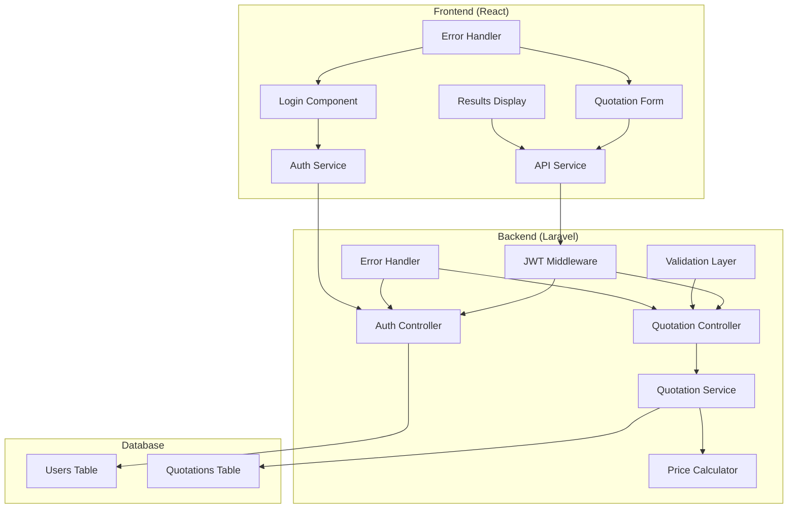

# Travel Insurance Quotation System - Architecture Plan

## System Overview

This project implements a travel insurance quotation system with a Laravel backend API and React frontend, featuring JWT authentication and complex pricing calculations.

## Architecture Diagram



## Key Components

### Backend (Laravel)

#### 1. Authentication System
- **JWT Package**: `tymon/jwt-auth`
- **Login Endpoint**: `POST /api/auth/login`
- **User Model**: Standard Laravel user with JWT traits
- **Middleware**: JWT verification for protected routes

#### 2. Quotation API
- **Endpoint**: `POST /api/quotation`
- **Headers**: `Content-Type: application/json`, `Authorization: Bearer <token>`
- **Validation**: Age format, currency codes, date formats
- **Business Logic**: Complex pricing calculations

#### 3. Pricing Calculation Service
```php
class PricingService {
    const RATE = 3;
    const AGE_LOADS = [
        '18-30' => 0.6,
        '31-40' => 0.7,
        '41-50' => 0.8,
        '51-60' => 0.9,
        '61-70' => 1.0
    ];
}
```

#### 4. Data Models
- **User**: Authentication
- **Quotation**: Store quotation history

### Frontend (React)

#### 1. Component Structure
```
src/
├── components/
│   ├── Auth/
│   │   └── LoginForm.jsx
│   ├── Quotation/
│   │   ├── QuotationForm.jsx
│   │   ├── AgeInput.jsx
│   │   ├── DateRangePicker.jsx
│   │   └── Results.jsx
│   └── Common/
│       └── ErrorDisplay.jsx
├── services/
│   ├── authService.js
│   └── apiService.js
└── utils/
    └── validation.js
```

#### 2. Key Features
- **Multi-age input**: Comma-separated or dynamic add/remove
- **Date validation**: ISO 8601 format, future dates
- **Currency selection**: EUR, GBP, USD dropdown
- **Real-time validation**: Form field validation
- **Error handling**: Network errors, validation errors, API errors

## API Specification

### Authentication
```json
POST /api/auth/login
{
    "email": "user@example.com",
    "password": "password"
}

Response:
{
    "access_token": "eyJ0eXAiOiJKV1QiLCJhbGciOiJIUzI1NiJ9...",
    "token_type": "bearer",
    "expires_in": 3600
}
```

### Quotation Request
```json
POST /api/quotation
Headers: {
    "Content-Type": "application/json",
    "Authorization": "Bearer <token>"
}

{
    "age": "28,35",
    "currency_id": "EUR",
    "start_date": "2024-10-01",
    "end_date": "2024-10-30"
}

Response:
{
    "total": 117.00,
    "currency_id": "EUR",
    "quotation_id": 1
}
```

## Business Logic Implementation

### Calculation Formula
```
Total = Fixed Rate × Age Load × Trip Length

For multiple ages:
Total = Σ(Fixed Rate × Age Load[i] × Trip Length)

Where:
- Fixed Rate = 3 per day
- Age Load = based on age bracket table
- Trip Length = inclusive date range
```

### Example Calculation
Ages: 28, 35 (brackets: 18-30, 31-40)
Dates: 2020-10-01 to 2020-10-30 (30 days)
```
Total = (3 × 0.6 × 30) + (3 × 0.7 × 30)
Total = 54 + 63 = 117.00
```

## Error Handling Strategy

### Backend Errors
- **Validation Errors**: 422 with field-specific messages
- **Authentication Errors**: 401 with clear messages
- **Server Errors**: 500 with generic messages
- **Rate Limiting**: 429 with retry information

### Frontend Errors
- **Form Validation**: Real-time field validation
- **Network Errors**: Retry mechanisms and user feedback
- **API Errors**: Parse and display backend error messages
- **Loading States**: Prevent multiple submissions

## Security Considerations

1. **JWT Token Management**
   - Secure storage (httpOnly cookies or secure localStorage)
   - Token expiration handling
   - Refresh token mechanism

2. **Input Validation**
   - Backend validation for all inputs
   - Frontend validation for UX
   - SQL injection prevention
   - XSS protection

3. **CORS Configuration**
   - Specific origin allowlist
   - Credential handling
   - Preflight request support

## Development Environment

### Backend Requirements
- PHP 8.4
- Laravel 13.x
- MySQL/PostgreSQL
- Composer

### Frontend Requirements
- Node.js LTS v22.20
- React v19.2
- Vite (build tool)
- Axios for HTTP requests

## Project Structure

```
Laravel_React_API/
├── backend/                 # Laravel API
│   ├── app/
│   │   ├── Http/Controllers/
│   │   ├── Models/
│   │   ├── Services/
│   │   └── Middleware/
│   ├── database/migrations/
│   ├── routes/api.php
│   └── config/
└── frontend/               # React SPA
    ├── src/
    │   ├── components/
    │   ├── services/
    │   └── utils/
    ├── public/
    └── package.json
```

## Testing Strategy

### Backend Testing
- Unit tests for calculation service
- Feature tests for API endpoints
- Integration tests for authentication flow

### Frontend Testing
- Component unit tests
- Integration tests for API communication
- E2E tests for complete user flows

## Performance Considerations

1. **Caching**: Cache age load tables and exchange rates
2. **Database Optimization**: Indexes on frequently queried fields
3. **Frontend Optimization**: Code splitting and lazy loading
4. **API Optimization**: Request/response compression

This architecture provides a solid foundation for implementing the travel insurance quotation system with proper separation of concerns, security, and maintainability.